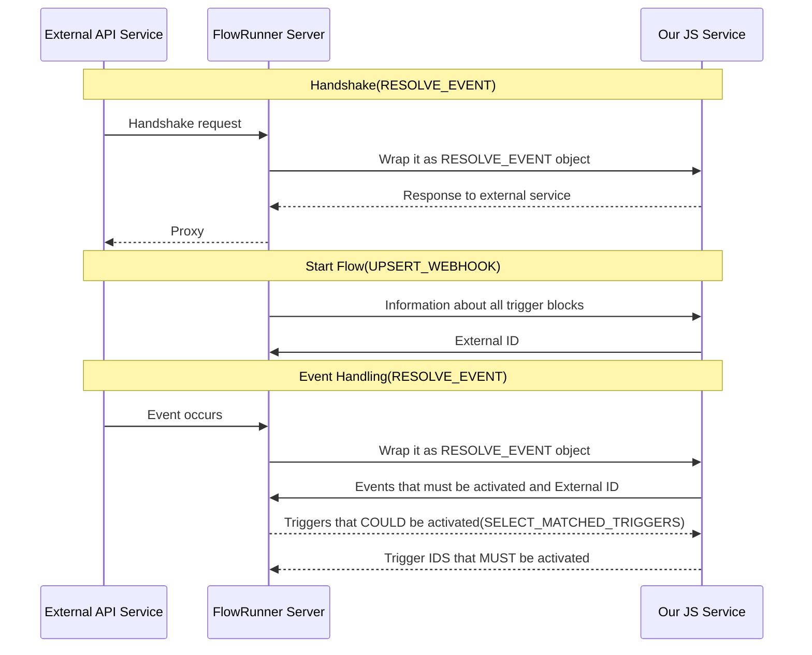
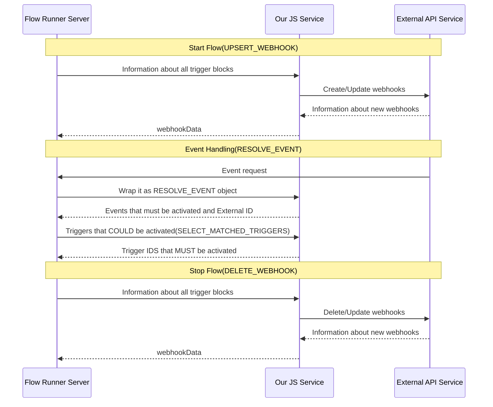

# FlowRunner Triggers Development Reference

> **Note**: For AI agents working on service review/improvement, use the consolidated guides in `/docs/ai/` folder as primary reference. This document provides detailed trigger implementation reference.

## REALTIME Triggers

### Determine the Trigger Type

To create a trigger, we first need to determine its type:

- **REALTIME** triggers, which can be of two subtypes:
  - **SINGLE_APP** - Those that allow creating **webhooks** for events dynamically.
  - **ALL_APPS** - Those that allow specifying a **callback url** in external service UI where all events from all user applications will be sent to one route.

### Define the FlowRunner Block

To create a **REALTIME** trigger, we need to define a block in **FlowRunner** that specifies the fields a user must fill in for the trigger to work correctly. To do this, create a method in the service that defines the block.

Method must be described using the following JSDoc tags:

- `@description` - method's description
- `@route` - method's HTTP method and its URI (use a REST-appropriate verb; trigger blocks typically use `POST`)
- `@operationName` - FlowRunner block display name
- `@registerAs REALTIME_TRIGGER`
- `@paramDef` - method's arguments
- `@returns` - method's output type
- `@sampleResult` - method's output example

### **Example of a Trigger Method Declaration:**

```js
/**
 * @description Triggered when a message is posted into the chosen channel.
 *
 * @route POST /on-message
 * @operationName On Message
 *
 * @registerAs REALTIME_TRIGGER
 *
 * @paramDef {"type":"String", "label":"Channel ID", "name":"channelId", "required":true, "dictionary":"getChannelsDictionary", "description": "The ID of the channel to listen messages."}
 *
 * @returns {Object}
 * @sampleResult {authorId:"user id",text:"text",channelId:"some string"}
 */
async onMessage() {}
```

When we describe our future trigger we could start its implementation

### Add a System Methods to the API Service

All services that contain triggers should implement the system methods:

1. `handleTriggerUpsertWebhook` - called when a flow is started to create webhooks in the external services

Example of its declaration:

```javascript
class TriggerService {
  /**
   * Upsert Webhook Invocation object.
   *
   * @typedef {Object} invocation
   * @property {string} [connectionId] - Optional connection identifier.
   * @property {string} callbackUrl - The URL provided by FlowRunner to which the webhook must send data.
   * @property {Array<Object>} events - List of events the webhook listens to.
   * @property {string} events[].name - Name of the event.
   * @property {Object} events[].triggerData - Data from the trigger FlowRunner block described in @paramDef's.
   * @property {Object|null} webhookData - Data previously returned from this method after creating/updating webhooks. Will be null when creating a new webhook.
   */

  /**
   * @registerAs SYSTEM
   * @paramDef {"type":"Object","label":"invocation","name":"invocation"}
   * @returns {Object}
   */
  async handleTriggerUpsertWebhook(invocation) {
    // Logic that creates new or removes unused webhooks for SINGLE_APP triggers or retrieve eventScopeId for ALL_APPS triggers
    // Note: if your service is protected by OAuth and requires access tokens for event handling, you must add the connectionId as a query parameter to the callbackUrl.

    return {
      eventScopeId: 'String', // Optional. Needed only for case when events for all external service integrations are forwarded to a single FlowRunner endpoint. In case when each application has its own callback URL this field is not required.
      refreshIntervalInSeconds: 100, // Optional. Set to positive number if you need to refresh your webhooks in certain interval.
      webhookData: {}, // Optional. You could return object of any shape to maintain state for multiple webhooks creation
    }
  }
}
```

2. `handleTriggerResolveEvents` - called when external service send events to us

Example of its declaration:

```javascript
class TriggerService {
  /**
   * Resolve Event Invocation object.
 *
 * @typedef {Object} invocation
 * @property {string} [connectionId] - Optional connection identifier.
 * @property {Object} headers - object with event headers
 * @property {Object} queryParams - object with event query string params
 * @property {Object} body - object with event body
 */

/**
* @registerAs SYSTEM
* @paramDef {"type":"Object","label":"invocation","name":"invocation"}
* @returns {Object}
*/
async handleTriggerResolveEvents(invocation) {
    // Logic that shapes FlowRunner events from external api service data

    return {
        handshake: "Boolean", // Optional. 'false' by default. When set to 'true' the server will not attempt to apply processing logic to this event and simply return content of 'responseToExternalService' field",
        responseToExternalService: "Value of any type", // Value of any type which will be returned to the sender of event. Can be used to implement 'test handshake' during callback URL registration in external service
        eventScopeId: "String", // Optional. Needed only for case when events for all external service integrations are forwarded to a single FlowRunner endpoint. In case when each application has its own callback URL this field is not required
        connectionId: "String", // Optional. Should be passed if was provided during webhook creation.
        events: [{
            name: "String", // Name of event. You could use it for choosing needed methods to process external data.
            data: {}, // Data for this event that will be passed to next FlowRunner block
        }],
    }
}
```

3. `handleTriggerSelectMatched` - method is used to filter out triggers which are not affected by this event. For example if there is an "file created" event trigger and it listens for events from "images" directory but "file created" event arrived for "documents" directory, such trigger should be filtered out since event is for different directory. Server itself does not know how to handle or compare `data` objects of the triggers since for each external service they will have different structure and it is responsibility of related CloudCode service to handle the matters.

Example of its declaration:

```js
/**
* Select Matched Triggers Invocation object.
*
* @typedef {Object} invocation
* @property {string} [connectionId] - Optional connection identifier.
* @property {Array<Object>} triggers - List of triggers to filter.
* @property {string} triggers[].id - unique identifier used on response.
* @property {Object} triggers[].data - Data from the FlowRunner trigger blocks described in @paramDef's and filled in UI.
* @property {Object|null} webhookData - Data previously returned from this method after creating/updating webhooks. Will be null when creating a new webhook.
* @property {String} eventName - Event name that we use when handle events.
* @property {Object|null} eventData - Event data which was received from external service via webhook.
  */

/**
* @registerAs SYSTEM
* @paramDef {"type":"Object","label":"invocation","name":"invocation"}
* @returns {Object}
*/
async handleTriggerSelectMatched(invocation) {
    // Logic that filters triggers

    return {
        ids: [ "A list of IDs of triggers affected by this event" ],
        enrichedEventData: {} // "Enriched event data. This is an optional field that allows to add additional information basing on passed connection token. If field contains null then original event data will be used by the server"
    }
}
```

4. `handleTriggerRefreshWebhook` - optional method, used for refreshing webhooks if needed.

Example of its declaration:

```js
/**
 * Refresh Webhook Invocation object.
 *
 * @typedef {Object} invocation
 * @property {string} [connectionId] - Optional connection identifier.
 * @property {string} callbackUrl - The URL provided by FlowRunner to which the webhook must send data.
 * @property {Array<Object>} events - List of events the webhook listens to.
 * @property {string} events[].name - Name of the event.
 * @property {Object} events[].triggerData - Data from the FlowRunner trigger block described in @paramDef's and filled in UI.
 * @property {Object|null} webhookData - Data previously returned from this method after creating/updating webhooks. Will be null when creating a new webhook.
 */

/**
* @registerAs SYSTEM
* @paramDef {"type":"Object","label":"invocation","name":"invocation"}
* @returns {Object}
*/
async handleTriggerRefreshWebhook(invocation) {
    // Logic that refreshes existing webhooks

    return {
      refreshIntervalInSeconds: 100, // New expiration of webhook
      webhookData: {}, // Optional. New webhook data.
    }
}
```

5. `handleTriggerDeleteWebhook` - called when we stop flows of to delete webhooks in the external services

Example of its declaration:

```js
/**
 * Delete Webhook Invocation object.
 *
 * @typedef {Object} invocation
 * @property {string} [connectionId] - Optional connection identifier.
 * @property {string} callbackUrl - The URL provided by FlowRunner to which the webhook must send data.
 * @property {Object|null} webhookData - Data previously returned from this method after creating/updating webhooks. Will be null when creating a new webhook.
 */

/**
* @registerAs SYSTEM
* @paramDef {"type":"Object","label":"invocation","name":"invocation"}
* @returns {Object}
*/
async handleTriggerDeleteWebhook(invocation) {
    // Logic that will delete existed webhooks

    return {
      webhookData: {}, // Optional. New webhook data.
    }
}
```

### **Interaction Scheme for General Realtime Trigger**



#### **Example Implementation of the ALL_APPS Realtime Trigger:**

```js
class MessageService {
  /**
   * @registerAs SYSTEM
   * @paramDef {"type":"Object","label":"invocation","name":"invocation"}
   * @returns {Object}
   */
  async handleTriggerUpsertWebhook(invocation) {
    // fetchTeamIdFromExternalApi is example function to retrieve field that will be used by FlowRunner server to filter events between different apps, you must implement it by yourself
    const teamId = await fetchTeamIdFromExternalApi()

    return { eventScopeId: teamId }
  }

  /**
   * @registerAs SYSTEM
   * @paramDef {"type":"Object","label":"invocation","name":"invocation"}
   * @returns {Object}
   */
  async handleTriggerResolveEvents(invocation) {
    const methodName = invocation.body.event.type // "onMessage" in our case

    const events = await this[methodName]('SHAPE_EVENT', invocation.body)

    return {
      eventScopeId: invocation.body.teamId,
      events,
    }
  }

  /**
   * @registerAs SYSTEM
   * @paramDef {"type":"Object","label":"invocation","name":"invocation"}
   * @returns {Object}
   */
  async handleTriggerSelectMatched(invocation) {
    return this[invocation.eventName]('FILTER_TRIGGER', invocation)
  }

  /**
   * @description Triggered when a message is posted into the chosen channel.
   *
   * @route POST /on-message
   * @operationName On Message
   *
   * @registerAs REALTIME_TRIGGER
   *
   * @paramDef {"type":"String", "label":"Channel ID", "name":"channelId", "required":true, "dictionary":"getChannelsDictionary", "description": "The ID of the channel."}
   *
   * @returns {Object}
   * @sampleResult {authorId:"user id",text:"text",channelId:"some string"}
   */
  async onMessage(callType, invocation) {
    if (callType === 'SHAPE_EVENT') {
      const { user, text, channel } = invocation.event

      return [
        {
          name: 'onMessage',
          // This data will be passed into next FlowRunner block
          data: {
            authorId: user,
            text,
            channelId: channel,
          },
        },
      ]
    } else if (callType === 'FILTER_TRIGGER') {
      return {
        // filterByChannelId is example filtering function, you must implement it by yourself
        ids: filterByChannelId(invocation.triggers, invocation.eventData.channelId),
      }
    }
  }
}
```

### **Interaction Scheme for App Based Trigger**



#### **Example Implementation of an SINGLE_APP Realtime Trigger:**

```js
class MessageService {
  /**
   * @registerAs SYSTEM
   * @paramDef {"type":"Object","label":"invocation","name":"invocation"}
   * @returns {Object}
   */
  async handleTriggerUpsertWebhook(invocation) {
    const webhookIds = await createWebhooks(invocation.callbackUrl, invocation.events)
    // The createWebhooks function should be implemented by you. It should contain the logic for creating webhooks.
    // Note: if your service is protected by OAuth and requires access tokens for event handling, you must add the connectionId as a query parameter to the callbackUrl.

    return {
      webhookData: { ids: webhookIds },
    }
  }

  /**
   * @registerAs SYSTEM
   * @paramDef {"type":"Object","label":"invocation","name":"invocation"}
   * @returns {Object}
   */
  async handleTriggerResolveEvents(invocation) {
    const methodName = invocation.body.event.type // in our case - "onMessage"

    const events = await this[methodName]('SHAPE_EVENT', invocation.body)

    return { events }
  }

  /**
   * @registerAs SYSTEM
   * @paramDef {"type":"Object","label":"invocation","name":"invocation"}
   * @returns {Object}
   */
  async handleTriggerSelectMatched(invocation) {
    return this[invocation.eventName]('FILTER_TRIGGER', invocation)
  }

  /**
   * @description Triggered when a message is posted into the chosen channel.
   *
   * @route POST /on-message
   * @operationName On Message
   *
   * @registerAs REALTIME_TRIGGER
   *
   * @paramDef {"type":"String", "label":"Channel ID", "name":"channelId", "required":true, "dictionary":"getChannelsDictionary", "description": "The ID of the channel."}
   *
   * @returns {Object}
   * @sampleResult {authorId:"user id",text:"text",channelId:"some string"}
   */
  async onMessage(callType, invocation) {
    if (callType === 'SHAPE_EVENT') {
      const { user, text, channel } = invocation.event

      return [
        {
          name: 'onMessage',
          data: {
            authorId: user,
            text,
            channelId: channel,
          },
        },
      ]
    } else if (callType === 'FILTER_TRIGGER') {
      return {
        // filterByChannelId is example filtering function, you must implement it by yourself
        ids: filterByChannelId(invocation.triggers, invocation.eventData.channelId),
      }
    }
  }
}
```

## POLLING Triggers

### Define the FR Block

To create a **POLLING** trigger, we need to define a block in **FlowRunner** that specifies the fields a user must fill in for the trigger to work correctly. To do this, create a method in the service that defines the block.

Method must be described by next JSDoc tags:

- `@description` - method's description (must include polling interval information: "Polling interval can be customized (minimum 30 seconds).")
- `@route` - method's HTTP method and its URI (use a REST-appropriate verb; trigger blocks typically use `POST`)
- `@operationName` - FlowRunner block display name
- `@registerAs POLLING_TRIGGER`
- `@paramDef` - method's arguments
- `@returns` - method's output type
- `@sampleResult` - method's output example

### **Example of a Trigger Method Declaration:**

```js
/**
 * @description Triggered when a message is posted into the chosen channel. Polling interval can be customized (minimum 30 seconds).
 *
 * @route POST /on-message
 * @operationName On Message
 *
 * @registerAs POLLING_TRIGGER
 *
 * @paramDef {"type":"String", "label":"Channel ID", "name":"channelId", "required":true, "dictionary":"getChannelsDictionary", "description": "The ID of the channel to listen messages."}
 *
 * @returns {Object}
 * @sampleResult {authorId:"user id",text:"text",channelId:"some string"}
 */
async onMessage() {
    // Implementation will be added later
  }
```

When we describe our future trigger we can begin its implementation

### Add a System Methods to the API Service

All services that contain polling triggers should implement the system method:

`handleTriggerPollingForEvent` - called when a flow is started to create webhooks in the external services

Example of its declaration:

```
/**
 * Polling Event Invocation object.
 *
 * @typedef {Object} invocation
 * @property {string} [connectionId] - Optional connection identifier.
 * @property {string} eventName - name of trigger method that was called.
 * @property {Object} triggerData - data from the FlowRunner trigger block described in @paramDef's and filled in UI.
 * @property {Object} state - object with data that you store between trigger method calls
 */

/**
* @registerAs SYSTEM
* @paramDef {"type":"Object","label":"invocation","name":"invocation"}
* @returns {Object}
*/
async handleTriggerPollingForEvent(invocation) {
    return {
        "events": [],
        "state": {}
    }
}
```

### **Polling Trigger Mechanism Overview**

This system implements a polling-based event detection mechanism, where external services repeatedly call a defined
endpoint to check for new data. Instead of pushing events instantly, the system compares the current state of data
with the previously stored state to detect changes. It maintains state between calls to identify only new or relevant items.
This approach allows for event-like behavior without requiring real-time infrastructure, making it simple and reliable for
systems that can’t receive pushed updates.

### **Example Implementation of the POLLING Trigger:**

```js
class MessageService {
  /**
   * @registerAs SYSTEM
   * @paramDef {"type":"Object","label":"invocation","name":"invocation"}
   * @returns {Object}
   */
  async handleTriggerPollingForEvent(invocation) {
    return this[invocation.eventName](invocation)
  }

  /**
   * @description Triggered when a message is posted into the chosen channel. Polling interval can be customized (minimum 30 seconds).
   *
   * @route POST /on-message
   * @operationName On Message
   *
   * @registerAs POLLING_TRIGGER
   *
   * @paramDef {"type":"String", "label":"Channel ID", "name":"channelId", "required":true, "dictionary":"getChannelsDictionary", "description": "The ID of the channel."}
   *
   * @returns {Object}
   * @sampleResult {authorId:"user id",text:"text",channelId:"some string"}
   */
  async onMessage(invocation) {
    const { channelId } = invocation.triggerData

    const messages = await fetchMessages(channelId)

    if (!invocation.state?.messages) {
      return {
        events: [],
        state: { messages },
      }
    }

    const prevIDs = new Set(invocation.state.messages.map(({ id }) => id))

    return {
      events: messages.filter(({ id }) => !prevIDs.has(id)),
      state: { messages },
    }
  }
}
```
