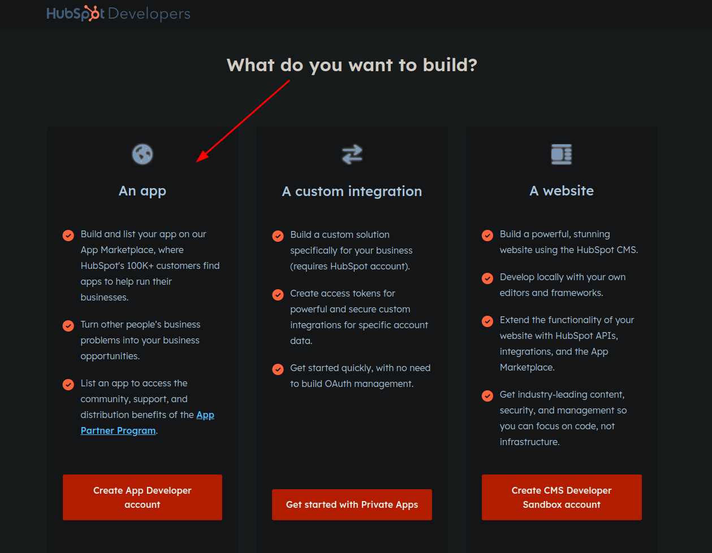
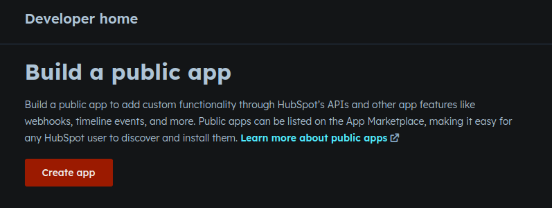
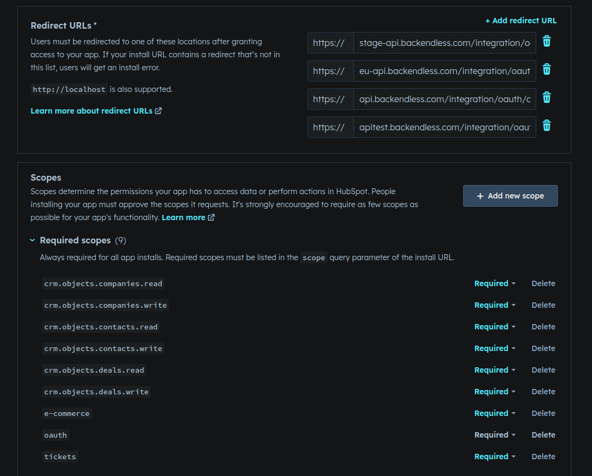

1. Go to [**HubSpot**](https://developers.hubspot.com/get-started)
2. Create App Developer Account: 
3. Login or create a new account
4. Create a public app: 
5. Provide app details (name, logo, description)
6. Configure Auth settings (redirect URL and required scopes): 

    Redirect URLs:

   - `https://app.flowrunner.ai/api/integration/oauth/callback`

    Required scopes:

   - `oauth`
   - `crm.objects.contacts.read`
   - `crm.objects.contacts.write`
   - `crm.objects.companies.read`
   - `crm.objects.companies.write`
   - `crm.objects.deals.read`
   - `crm.objects.deals.write`
   - `tickets`
   - `e-commerce`

[**Creating public app guide**](https://developers.hubspot.com/docs/api/creating-an-app)
