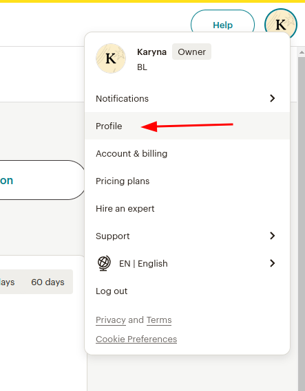
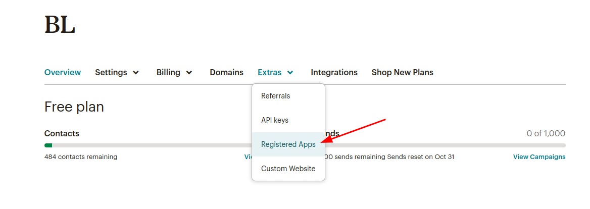
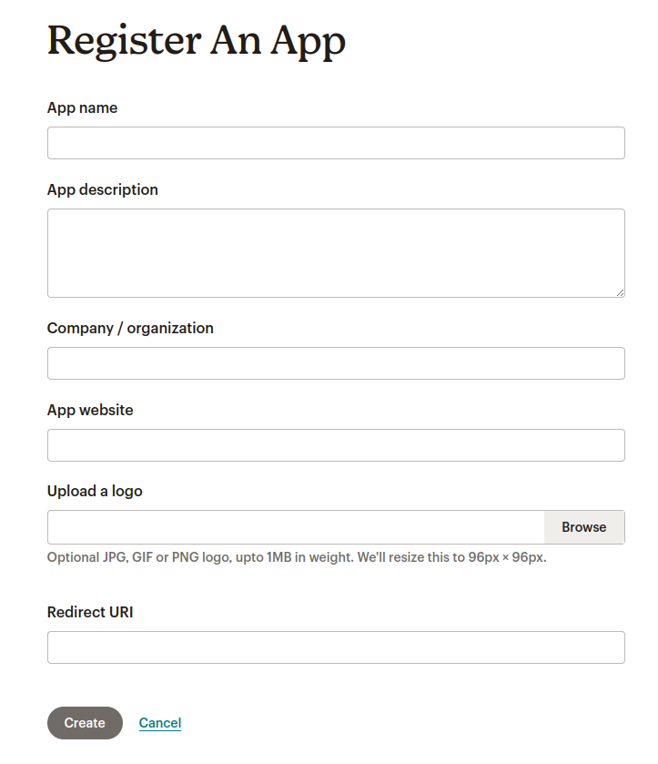

**Get Client ID and Client Secret:** 

1. Go to [Mailchimp Login](https://login.mailchimp.com/) page
2. Login or create a new account
3. Navigate to your _Profile_:  
4. Go to _Extras_ -> _Registered apps_: 
5. Click the **Register An App** button
6. Provide app details (name, description, company, website, logo, redirect URI). 
   Redirect URI: `https://app.flowrunner.ai/api/integration/oauth/callback`   
   
7. After registering your application, you'll get _Client ID_ and _Client Secret Key_. Save it because you won’t be able to see or copy this API key again.
