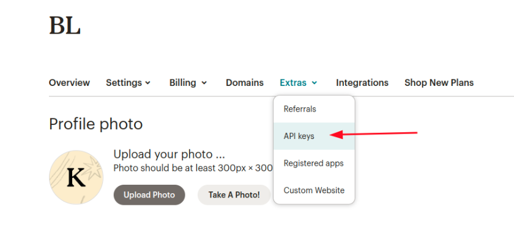
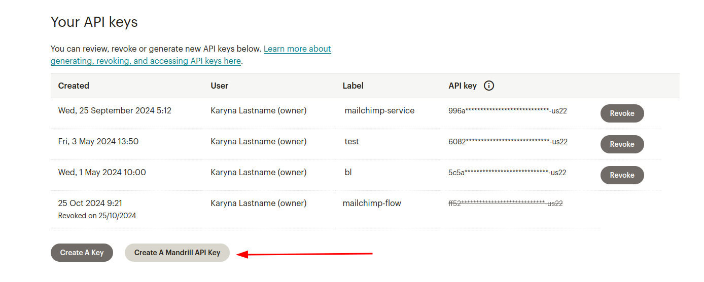
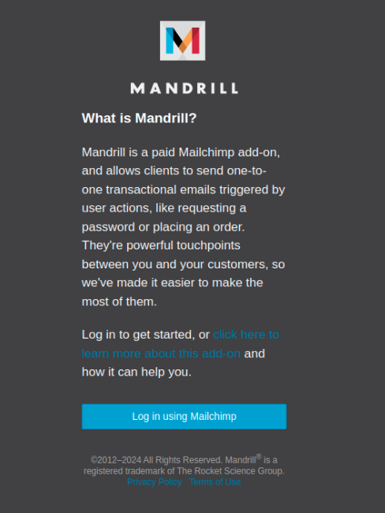
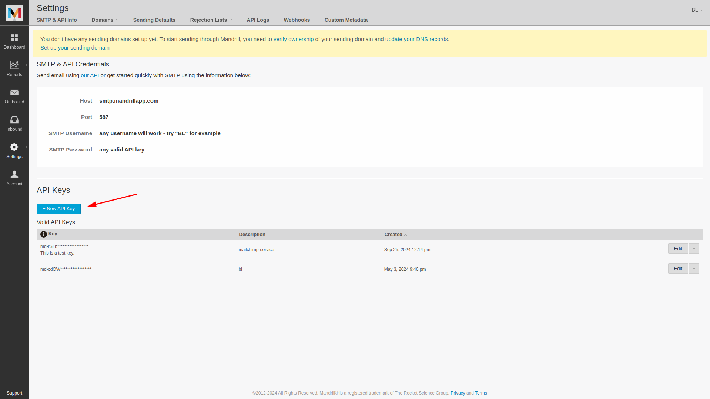

**Get Mandrill API Key** (ensure you have a Standard or Premium Mailchimp plan, as the Mandrill add-on is only available on these paid plans):  

1. Log in/Sign up to your [Mailchimp](https://login.mailchimp.com/) account and go to _Profile_:  
2. Go to _Extras_ → _API Keys_:  
3. Create a Mandrill API Key:  
4. You'll be redirected to [Mandrill Login](https://mandrillapp.com/login/?referrer=%2Fsettings%2Findex%2F) page:  
5. Log in using Mailchimp, and you'll see the [Mandrill Settings](https://mandrillapp.com//settings/index/) page:  
6. Create a new API Key and save it because you won’t be able to see or copy this API key again.
