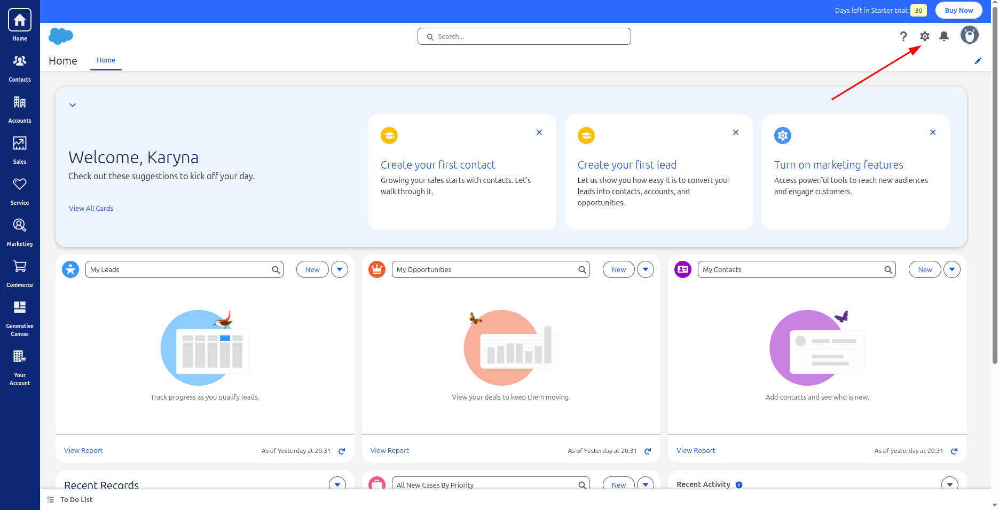
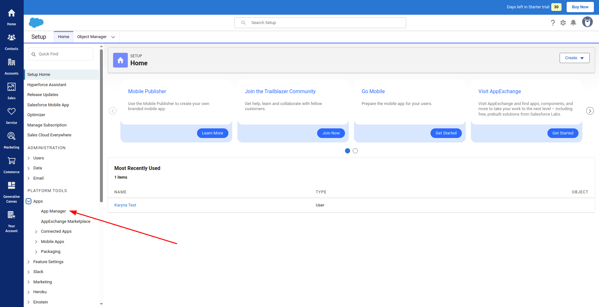
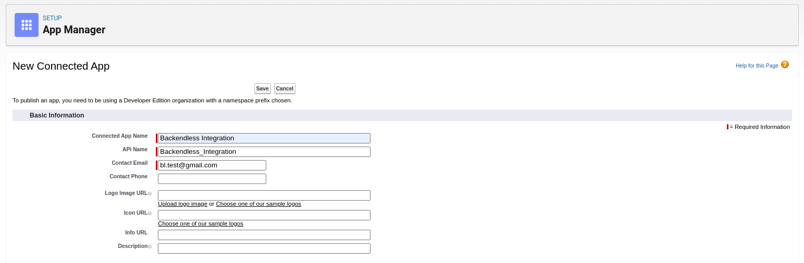
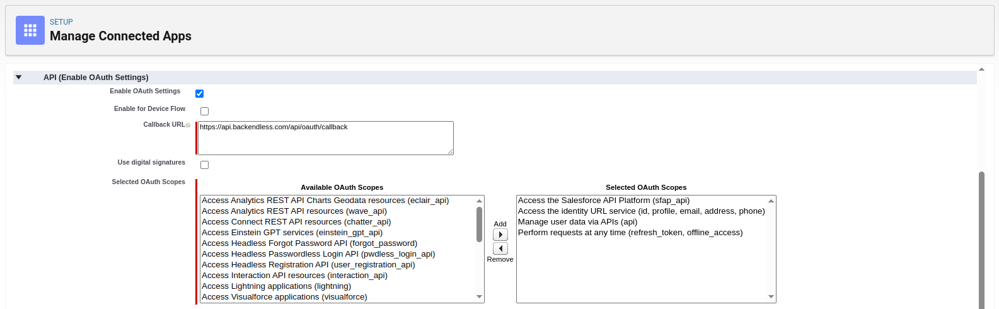
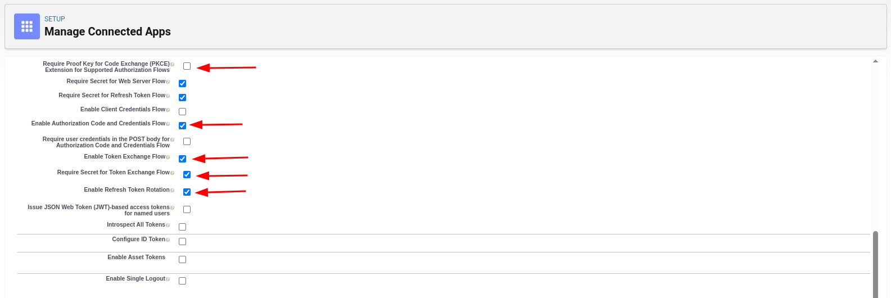
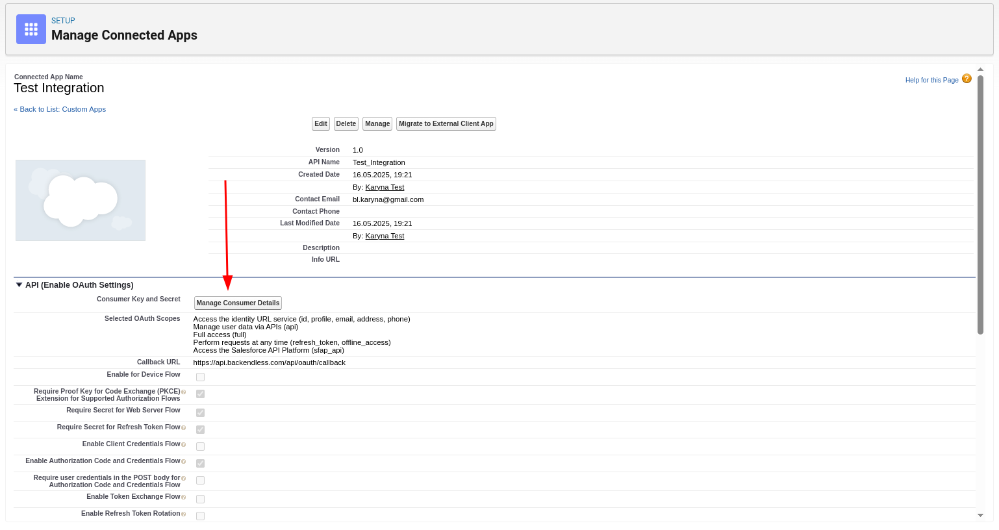

1. Go to [Salesforce Login Page](https://login.salesforce.com/) and sign up

2. Click the **Quick Settings** icon:   
      

3. Click the **Open Advanced Setup** button

4. Navigate to **Platform Tools → Apps → App Manager**:   
      

5. In the top-right corner, click **New Connected App**

6. Choose: **Create a Connected App**

7. Enter the basic information:   
      

8. Check: **Enable OAuth Settings**

9. Set redirect URI and scopes:   
      

10. Uncheck: **Require Proof Key for Code Exchange (PKCE)**

11. Check: **Enable Authorization Code and Credentials Flow**:   
       

12. Save your changes

13. After saving, click **Manage Consumer Details**:   
       

14. Enter the verification code

15. Copy: **Consumer Key** and **Consumer Secret**

[Salesforce Documentation](https://developer.salesforce.com/docs/atlas.en-us.api_rest.meta/api_rest/intro_rest.htm)
