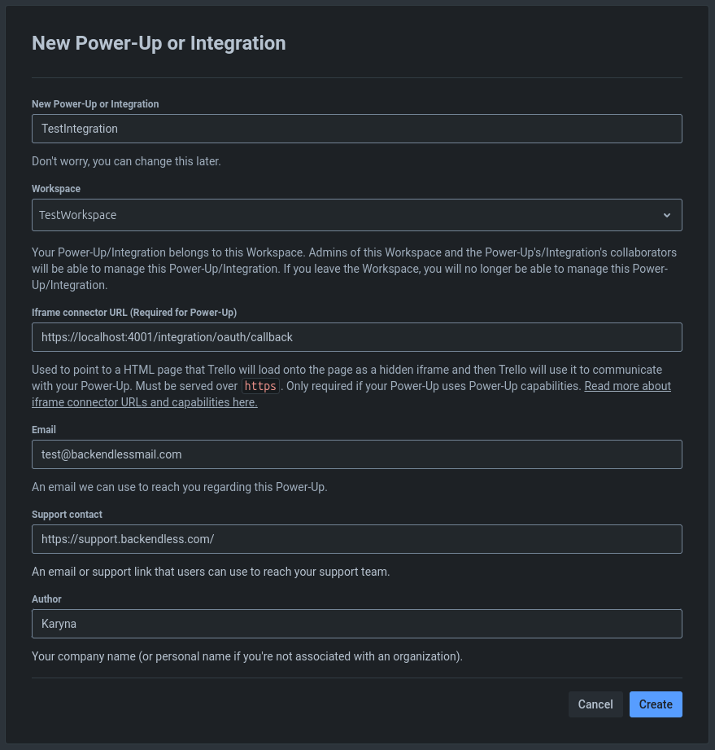
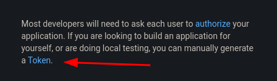

1. Go to [Trello](https://trello.com)
2. Sign up or log in to your account
3. Open the [Developer API Keys](https://trello.com/app-key) page
4. Go to the [Power-Up Admin Portal](https://trello.com/power-ups/admin/)
5. Create a new **Power-Up or Integration**
6. Fill in the basic information:

7. Navigate to **API Key** tab
8. Click **Generate a new key**
9. Add **Allowed origins** domains like:

- _https://app.flowrunner.ai_

9. On the right-hand panel, you will see an option to generate a token:

10. Click the **Token** link and it will open in a new browser tab
11. Scroll to the bottom of the page and click the **Allow** button
12. You will be shown your personal token, copy it

[Trello Official Documentation](https://developer.atlassian.com/cloud/trello/)
